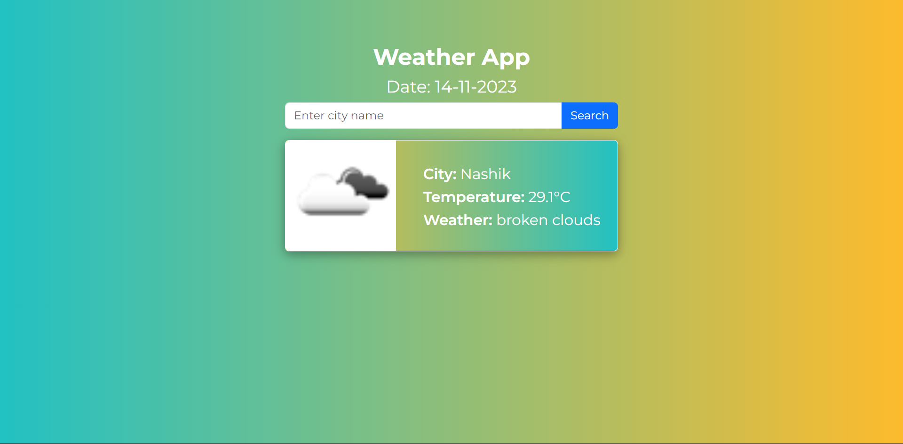

# Weather App

This is a simple weather app that provides weather information based on user input.



## Installation

1. Clone the repository:

   ```bash
   git clone <repository-url>

2. Install the required packages:
    ```bash
    pip install -r requirements.txt

3. Get an API key from OpenWeatherMap API.

4. Create a .env file in the root directory and add the API key:
    ```bash
    WEATHER_API_KEY=<your-api-key>

## Usage
Start the Flask server:
* Run Flask Server
    ```bash
  flask --app main run --debug
* Open your web browser and go to http://localhost:5000.

* Enter a location in the input field and click "Search" to view the weather information.

### Contributing
Pull requests are welcome. For major changes, please open an issue first to discuss what you would like to change.